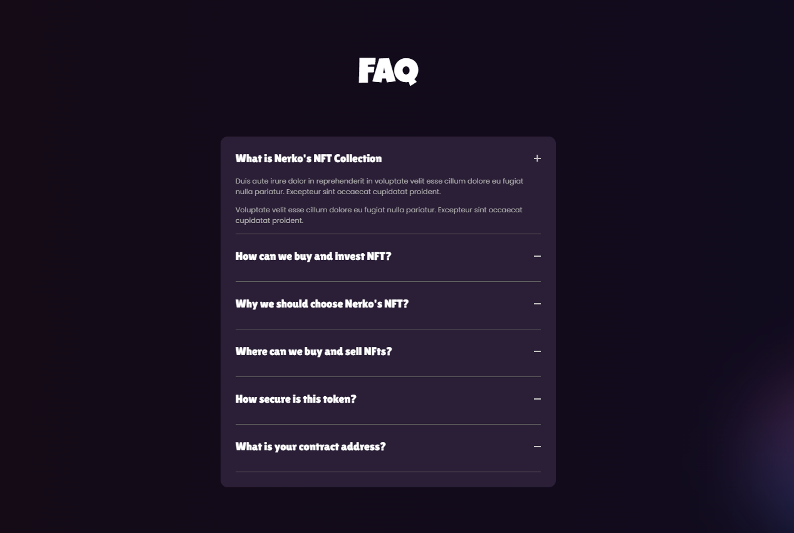

# NFT Market Website in Astro

## Libraries & Tech Used
- React :- for React Component 
- Framer Motion :- for animation on hero section 
- GSAP :- for scroll reveal animation 


## How to run Locally

1. First clone or fork the repo, in the roor folder run ```npm install```.
2. After that, run the server using ```npm run dev```.


__You can view the live site *[Live Site](https://astro-animation-website.vercel.app/)*__

### NFT Website 



